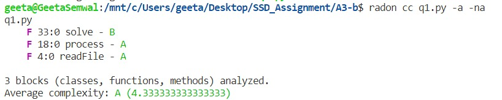
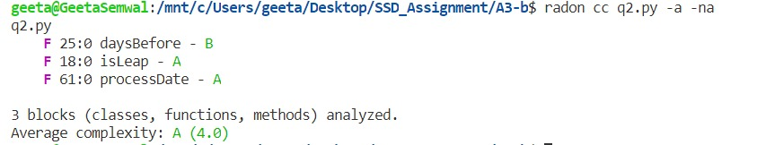

### SSD Assignment-2

**1)**

radon cc q1.py -a -na\
q1.py\
    F 33:0 solve - B\
    F 18:0 process - A\
    F 4:0 readFile - A

3 blocks (classes, functions, methods) analyzed.\
Average complexity: A (4.333333333333333)

**2)**

radon cc q2.py -a -na\
q2.py\
    F 25:0 daysBefore - B\
    F 18:0 isLeap - A\
    F 61:0 processDate - A

3 blocks (classes, functions, methods) analyzed.\
Average complexity: A (4.0)

**3)**

radon cc q3.py -a -na\
q3.py\
    F 48:0 inMin - B\
    F 26:0 process - A\
    F 4:0 isDateSame - A\
    F 72:0 getName - A

4 blocks (classes, functions, methods) analyzed.\
Average complexity: A (4.0)

**Question 2 and 3 are unchanged.**

Question 1 is updated. Code is now made modular using functions. 3 separated function are made of the existing code. Nothing is changed in the code. It's just divided into functions. 

**Github link -**https://github.com/rishabh26malik/SSD-ASSG-3